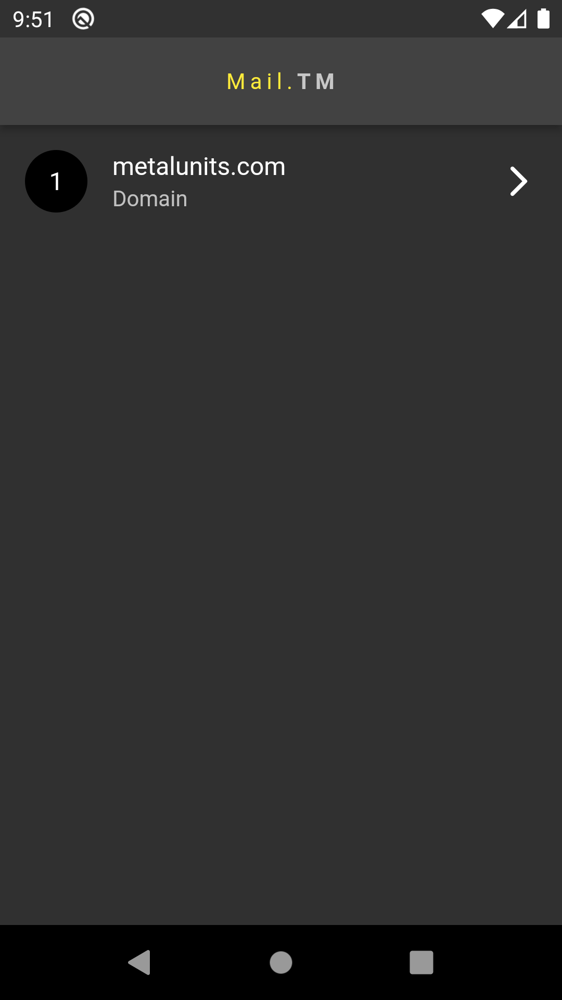
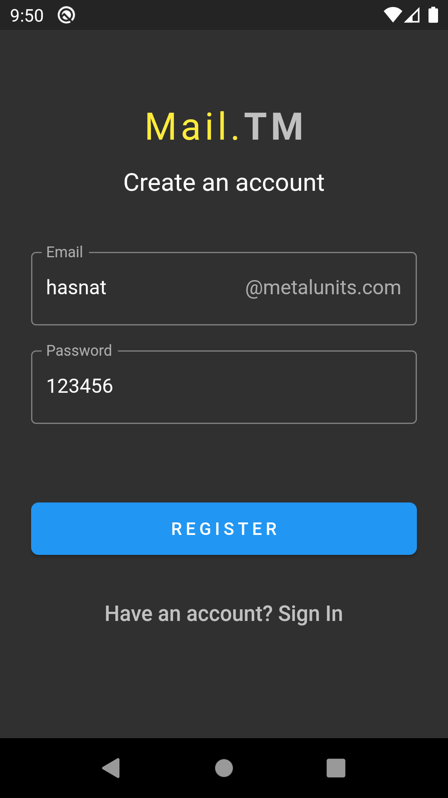
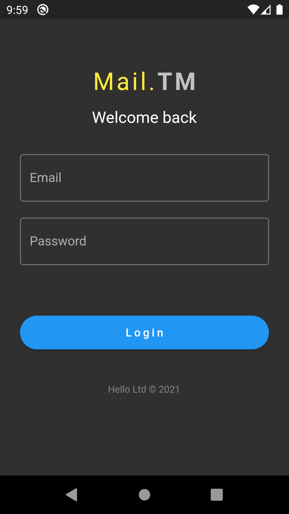
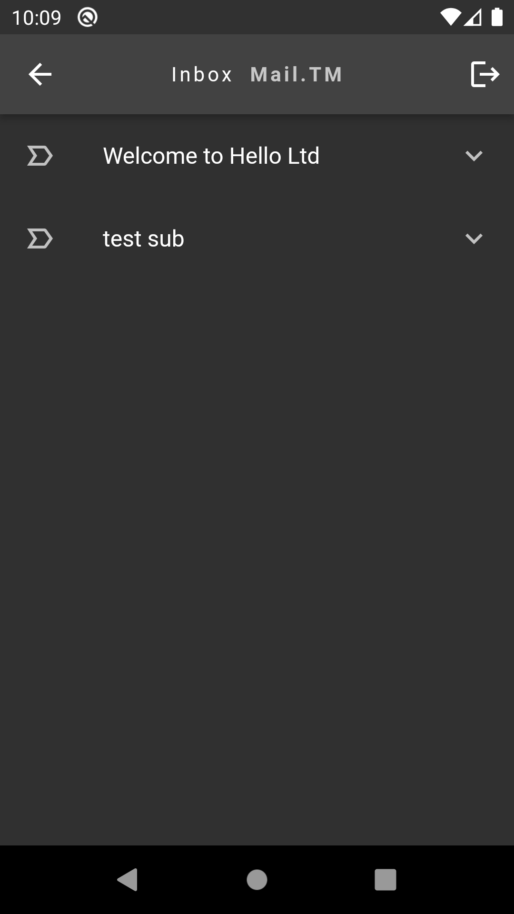

# *Mail.TM*
> _GetX, GetStorage, mail.tm APIs: flutter project_

### features-
* Domain list showing
* New account creation
* Get JWT token by Login
* fetching message list with expandable List
* attractive Material UI

[Download APK](https://github.com/TheHasnatBD/Mail.TM-Flutter/blob/master/files/apk.zip)
#### app screenshots

 Domain page                                | Registration                                | Login                                           | Messages / Inbox
:------------------------------------------:|:-------------------------------------------:|:-----------------------------------------------:|:-----------------------------------------------:
  | ||

